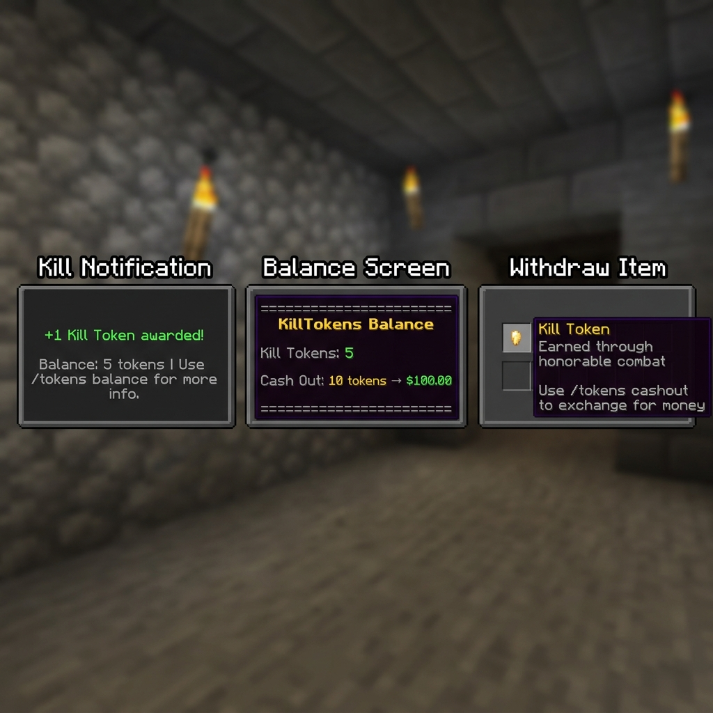

# KillTokens

KillTokens is a Spigot 1.20 plugin that rewards players with virtual kill tokens, supports Vault cashouts, adds physical token withdrawals, and includes a Refined Ore mining reward system with virtual storage.

## Features

| Feature | Detail |
| --- | --- |
| Kill rewards | Awards configurable kill tokens for PvP kills. |
| Vault cashout | Converts tokens into economy money. |
| Physical tokens | Withdraw virtual tokens as gold nugget items. |
| Central GUI | `/tokens` opens one GUI for tokens, Refined Ore, Compressed Refined Ore, cashout, storage, and withdrawals. |
| Refined Ore | Eligible ore breaks can drop Refined Ore or Compressed Refined Ore with pity counters. |
| Auto-storage | Players can store refined drops directly into virtual storage. |
| PlaceholderAPI | Exposes token, refined, cashout, storage, and dupe-flag placeholders. |
| Dupe protection | Storage-changing paths use guarded transactions and staff-visible warning flags. |
| YAML storage | Token and refined data persist in YAML files. |

## Requirements

- Java 17
- Spigot/Paper 1.20.x
- Vault and a Vault-compatible economy plugin
- PlaceholderAPI is optional, but required for placeholders

## Installation

1. Build the plugin jar with Maven.
2. Drop the jar from `target/` into your server's `plugins/` folder.
3. Install Vault and an economy plugin for cashouts.
4. Install PlaceholderAPI if placeholders are needed.
5. Restart the server.
6. Edit `plugins/KillTokens/config.yml`.

## Build

```bash
mvn clean package
```

On the local Windows setup used for this repo:

```powershell
C:\Users\banip\maven\apache-maven-3.9.6\bin\mvn.cmd package
```

## Commands

| Command | Permission | Description |
| --- | --- | --- |
| `/tokens` or `/tokens gui` | `killtokens.use` | Opens the central storage GUI. |
| `/tokens balance` | `killtokens.use` | Shows kill token balance and cashout rate. |
| `/tokens withdraw <amount>` | `killtokens.use` | Withdraws virtual kill tokens into physical token items. |
| `/tokens cashout` | `killtokens.use` | Converts the configured token amount into Vault money. |
| `/tokens set <player> <amount>` | `killtokens.admin` | Sets a player's kill token balance. |
| `/tokens add <player> <amount>` | `killtokens.admin` | Adds kill tokens to a player. |
| `/tokens remove <player> <amount>` | `killtokens.admin` | Removes kill tokens from a player. |
| `/refined` or `/refined balance` | `killtokens.refined` | Shows Refined Ore storage, totals, and auto-storage status. |
| `/refined storage` | `killtokens.refined` | Toggles automatic storage for mined Refined Ore drops. |
| `/refined store` | `killtokens.refined` | Moves physical Refined Ore items from inventory into virtual storage. |
| `/refined withdraw refined <amount>` | `killtokens.refined` | Withdraws stored Refined Ore. |
| `/refined withdraw compressed <amount>` | `killtokens.refined` | Withdraws stored Compressed Refined Ore. |
| `/refinedu` | `killtokens.refinedu` | Opens the merged Refined U Shopkeepers GUI. |

## Permissions

| Permission | Default | Description |
| --- | --- | --- |
| `killtokens.use` | `true` | Allows basic `/tokens` commands and GUI access. |
| `killtokens.admin` | `op` | Allows admin token set/add/remove commands. |
| `killtokens.refined` | `true` | Allows `/refined` commands. |
| `killtokens.refinedu` | `true` | Allows players to open the merged Refined U shop. |
| `killtokens.refined.admin` | `op` | Reserved for refined ore admin features. |
| `killtokens.alerts` | `op` | Receives dupe protection flag warnings. |

## Central GUI

`/tokens` opens a central GUI for kill tokens, Refined Ore, and Compressed Refined Ore. Players can view balances, cash out, withdraw items, toggle Refined Ore auto-storage, and store physical refined items.



All GUI mutation actions are guarded by the dupe protection service: a per-player operation lock plus a configurable action cooldown (`security.action-cooldown-ms`).

GUIs are identified by a custom `InventoryHolder` (`GuiHolder`), not by window title. This is safe with Geyser/Bedrock clients, immune to title collisions with other plugins, and unaffected by config reloads while a GUI is open. Drag events into the GUI are cancelled so items cannot be lost in the menu, and button feedback uses sounds that Geyser maps for Bedrock players.

## Geyser / Bedrock Support

No Geyser extension is required — the GUI is a standard double-chest inventory that Geyser translates natively. Specific accommodations:

- Holder-based GUI detection (Bedrock title rendering differences cannot break click handling).
- The action cooldown absorbs the duplicate rapid clicks Bedrock clients commonly send.
- Feedback sounds (`UI_BUTTON_CLICK`, `ENTITY_EXPERIENCE_ORB_PICKUP`, `ENTITY_VILLAGER_NO`) all have Bedrock mappings.
- Item names carry the key information; lore is supplementary (Bedrock shows lore less prominently).

## Refined Ore

Refined Ore rolls on natural ore block breaks. Silk Touch can be excluded with `refined.skip-silk-touch`. Fortune is intentionally ignored so each eligible ore break rolls once.

Default rewards:

- Refined Ore: `BLUE_DYE`, base `1/85`, pity after `100` misses.
- Compressed Refined Ore: `DIAMOND_NAUTILUS_ARMOR`, base `1/3500`, pity after `5000` misses.

Drop rates, pity thresholds, broadcast behavior, and item materials are configurable in `config.yml`.

## Configuration

```yaml
kill-reward: 1
cash-tokens: 10
cash-amount: 100.0
token-item-name: "&6Kill Token"
gui-title: "&8&lInstellar Storage"

security:
  # Minimum delay (ms) between economy actions per player
  action-cooldown-ms: 300

refined:
  # Accept old name-only refined items (pre-1.2). Disable once players
  # have re-stored their old drops; name matching is anvil-forgeable.
  accept-legacy-items: true
  ore-chance: 85
  ore-pity: 100
  compressed-chance: 3500
  compressed-pity: 5000
  broadcast-drops: true
  skip-silk-touch: true
  refined-item: BLUE_DYE
  compressed-item: DIAMOND_NAUTILUS_ARMOR

refinedu:
  enabled: true
  shopkeeper-id: 78
  open-command: "shopkeeper open {shopId}"
  dispatch-as-console: false
  temporary-permissions:
    - shopkeepers.openbyid
```

`/refinedu` dispatches the configured Shopkeepers open command for the merged admin shop. After adding the matching Shopkeepers entry to `plugins/Shopkeepers/save.yml`, leave `shopkeeper-id` at `78` or update it to the numeric ID you actually used.

## Dupe Protection And Staff Flags

KillTokens protects storage-changing paths with per-player operation locks. If a player triggers overlapping actions, a Vault cashout fails after deduction, or an item withdrawal overflows inventory, the plugin:

- blocks or safely completes the operation,
- logs a `[DupeFlag]` warning to the server log,
- notifies online staff with `killtokens.alerts`,
- exposes flag state through PlaceholderAPI.

Cashout paths deduct first, flush storage, then refund if the Vault deposit fails. Withdraw paths deduct virtual storage first and drop overflow items at the player's location instead of silently losing them.

## PlaceholderAPI

Identifier: `killtokens`

| Placeholder | Value |
| --- | --- |
| `%killtokens_balance%` | Current kill token balance. |
| `%killtokens_kill_reward%` | Tokens awarded per kill. |
| `%killtokens_cashout_cost%` | Tokens required for cashout. |
| `%killtokens_cashout_value%` | Money received per cashout. |
| `%killtokens_tokens_needed%` | Tokens still needed for cashout. |
| `%killtokens_can_cashout%` | `true` if the player can cash out. |
| `%killtokens_cashout_ready%` | Alias for cashout readiness. |
| `%killtokens_refined_balance%` | Stored Refined Ore balance. |
| `%killtokens_compressed_balance%` | Stored Compressed Refined Ore balance. |
| `%killtokens_refined_total%` | Lifetime Refined Ore earned. |
| `%killtokens_compressed_total%` | Lifetime Compressed Refined Ore earned. |
| `%killtokens_refined_pity%` | Current Refined Ore pity counter. |
| `%killtokens_compressed_pity%` | Current Compressed Refined Ore pity counter. |
| `%killtokens_auto_storage%` | `true` if Refined Ore auto-storage is enabled. |
| `%killtokens_total_virtual_items%` | Kill tokens plus stored refined balances. |
| `%killtokens_dupe_flags%` | Player dupe flag count. |
| `%killtokens_last_dupe_flag%` | Last recorded dupe flag summary. |

## Developer API

Other plugins can integrate through `com.example.killtokens.api.KillTokensApi`. Add KillTokens to your `softdepend` and:

```java
KillTokensApi api = KillTokensApi.get(); // null if KillTokens is disabled
if (api != null) {
    api.addTokens(player.getUniqueId(), 5);
    int refined = api.getRefinedBalance(player.getUniqueId());

    // Plugin items are PDC-tagged (killtokens:item-type), so shops can
    // verify authenticity instead of trusting display names:
    ItemStack token = api.createTokenItem(16);
    boolean real = api.isRefinedItem(someItem);
}
```

All API methods must be called from the main server thread.

### Item authenticity

All items issued by the plugin (kill tokens, Refined Ore, Compressed Refined Ore) carry an invisible `PersistentDataContainer` tag. `/refined store` and the GUI verify this tag, so anvil-renamed lookalikes are rejected once `refined.accept-legacy-items` is set to `false`.

## Storage Files

Runtime data is stored in the plugin data folder:

- `tokens.yml` for kill token balances.
- `refined_data.yml` for refined balances, lifetime totals, pity counters, and auto-storage toggles.

## Project Structure

```text
killtokens/
├── pom.xml
├── README.md
├── docs/
│   └── gui_preview.png
└── src/
    ├── main/
    │   ├── java/com/example/killtokens/
    │   └── resources/
    └── test/
```
